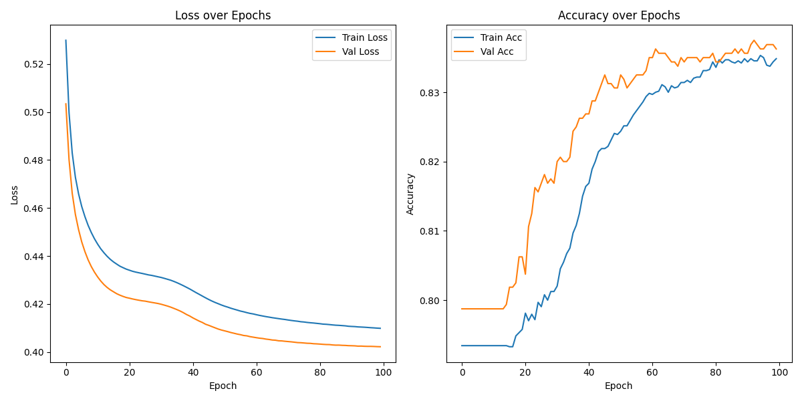

# Customer Churn Prediction using ANN

This project builds an Artificial Neural Network using TensorFlow/Keras to predict customer churn.

## 📁 Dataset
Churn_Modelling.csv

## 🚀 Technologies Used
- Python
- Pandas, NumPy, Matplotlib, Seaborn
- TensorFlow / Keras
- Scikit-learn

## 📊 Model Performance
- Accuracy: ~83% on validation data
- Loss and accuracy plots included

## 📎 Notebook
Check the full notebook [here](https://github.com/gauravkumar1364/customer-churn-prediction-ann/blob/main/Customer%20churn%20prediction.ipynb)

## 📷 Visualization

